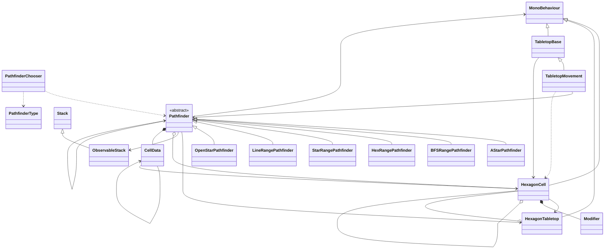
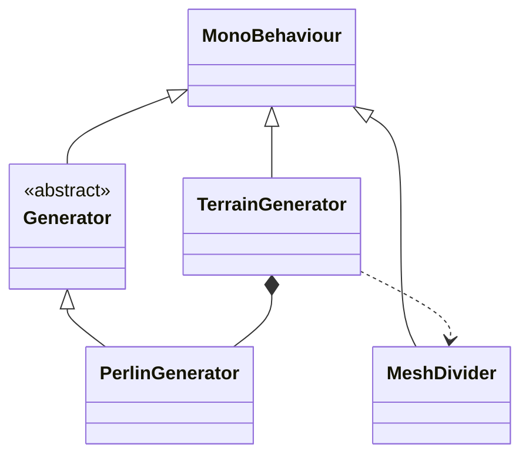
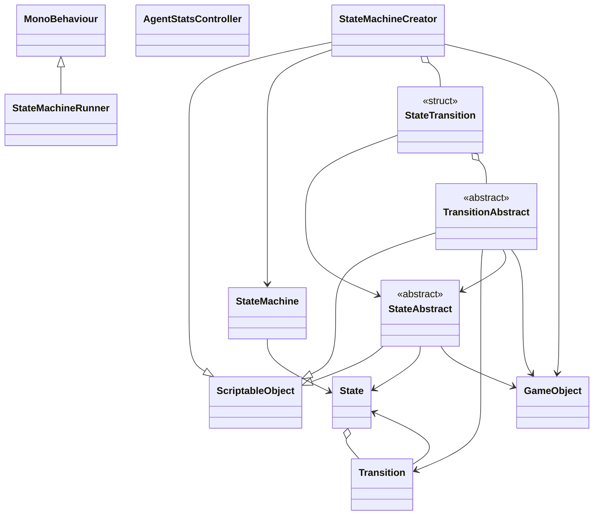

# Representation of AI in GDD

## UML Diagram Grid Based Pathfinding

```mermaid
classDiagram
  class MonoBehaviour

  class PathfinderChooser
  enum PathfinderType

  class Pathfinder
  <<abstract>> Pathfinder

  class AStarPathfinder
  class BFSRangePathfinder
  class HexRangePathfinder
  class StarRangePathfinder
  class LineRangePathfinder
  class OpenStarPathfinder

  class CellData
  class ObservableStack

  class Stack

  class HexagonCell
  class HexagonTabletop
  class TabletopBase
  class TabletopMovement

  class Modifier
  
  Stack <|-- ObservableStack

  Pathfinder <|-- AStarPathfinder
  Pathfinder <|-- BFSRangePathfinder
  Pathfinder <|-- HexRangePathfinder
  Pathfinder <|-- StarRangePathfinder
  Pathfinder <|-- LineRangePathfinder
  Pathfinder <|-- OpenStarPathfinder

  MonoBehaviour <|-- HexagonCell
  MonoBehaviour <|-- HexagonTabletop
  MonoBehaviour <|-- TabletopBase
  TabletopBase <|-- TabletopMovement


  PathfinderChooser ..> Pathfinder
  PathfinderChooser ..> PathfinderType

  Pathfinder --> HexagonTabletop
  Pathfinder --> ObservableStack
  Pathfinder --> MonoBehaviour
  Pathfinder o-- HexagonCell
  Pathfinder *-- CellData
  Pathfinder --> Pathfinder

  CellData --> CellData
  CellData --> HexagonCell

  HexagonCell --> HexagonTabletop
  HexagonCell *-- Modifier
  HexagonCell o-- HexagonCell

  HexagonTabletop o-- HexagonCell

  TabletopBase --> HexagonCell

  TabletopMovement --> Pathfinder
  TabletopMovement ..> HexagonCell
```

## UML Diagram Terrain Generation

```mermaid
classDiagram
  class MonoBehaviour

  class Generator
  <<abstract>> Generator

  class TerrainGenerator
  class PerlinGenerator
  class MeshDivider
  
  MonoBehaviour <|-- Generator
  MonoBehaviour <|-- TerrainGenerator
  MonoBehaviour <|-- MeshDivider
  Generator <|-- PerlinGenerator

  TerrainGenerator ..> MeshDivider
  TerrainGenerator *-- PerlinGenerator
```

## UML Diagram State Machines

#### UML Diagram

```mermaid
classDiagram
  class MonoBehaviour
  class ScriptableObject

  class AgentStatsController
  class StateMachineRunner
  class StateMachine
  class StateAbstract
  class TransitionAbstract
  <<abstract>> TransitionAbstract
  class StateTransition
  <<struct>> StateTransition
  class Transition

  MonoBehaviour <|-- StateMachineRunner

  class State
  class Transition
  class StateMachine
  class StateAbstract
  <<abstract>> StateAbstract
  class TransitionAbstract
  <<abstract>> TransitionAbstract
  class StateTransition
  <<struct>> StateTransition
  class StateMachineCreator
  class StateMachineRunner

  State o-- Transition

  Transition --> State

  StateMachine --> State

  StateAbstract --|> ScriptableObject
  StateAbstract --> State
  StateAbstract --> GameObject

  TransitionAbstract --|> ScriptableObject
  TransitionAbstract --> Transition
  TransitionAbstract --> StateAbstract
  TransitionAbstract --> GameObject

  StateMachineCreator --|> ScriptableObject
  StateMachineCreator --> StateMachine
  StateMachineCreator o-- StateTransition
  StateMachineCreator --> GameObject

  StateTransition --> StateAbstract
  StateTransition o-- TransitionAbstract

```
